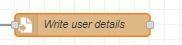

# Sandu-Emergency Detection & Handling using Wearable Device SCDFXIBM
"An idea that allows vulnerable populations to seek help immediately when emergency happens."

-Presented by Ng Wei Soon & Lim Hui Yi


## Contents

1. [Short description](#short-description)
1. [Demo video](#demo-video)
1. [The architecture](#the-architecture)
1. [Long description](#long-description)
1. [Getting started](#getting-started)
1. [Built with](#built-with)
1. [Contributing](#contributing)

## Short description

### What's the problem?

SCDF works closely with Community First Responders (CFRs) to provide timely relief and response to emergency situations.With the increasingly aging population and a growing segment of vulnerable populations in mind (e.g. increasing trend of elderly with no next of kin), how might we leverage analytics for better sense-making to be alerted at the onset of incidents which require emergency response (e.g. cardiac arrests, falls etc.) and mobilise CFRs for effective early intervention especially to the vulnerable populations?

### How can technology help?

With the advancement in electronic chips technolofy, small and convenient fitness tracker has become increasing common among the citizens as it allows the users to monitor thier health condition easily. On top of that, a few Fitness tracker companies are collaborating with Singapore HealthHub to give out affordable or even free fitness trackers to the citizens. Hence, it is a right timing for SCDF to harness ths

### The idea

It's imperative that learning and creating can continue when educational institutions have to shift the way they teach in times of crises, such as the COVID-19 pandemic. Providing a set of open source tools, backed by IBM Cloud and Watson Services, will enable educators to more easily make content available for their students.

## Demo video

[](https://youtu.be/vOgCOoy_Bx0)

## The architecture


1. The user navigates to the site and uploads a video file.
2. Watson Speech to Text processes the audio and extracts the text.
3. Watson Translation (optionally) can translate the text to the desired language.
4. The app stores the translated text as a document within Object Storage.

## Long description

[More detail is available here](DESCRIPTION.md)


## Getting started

Steps to run the demo

### 1. Install Node-RED [locally](https://nodered.org/docs/getting-started/).

After Node-RED is installed, add the dependencies:

```bash
npm install node-red-dashboard node-red-contrib-alasql node-red-contrib-prib-functions
```

### 2. Prepare inputs

* [Clone this repo](https://github.com/kanabu97/Sandu-Emergency_Detection-Handling_using_Wearable_Device_SCDFXIBM.git)
* Download and extract the zip file at the desired directory in local drive.


### 3. Import the Node-RED flow

* Navigate to the [nodered.json](https://github.com/kanabu97/Sandu-Emergency_Detection-Handling_using_Wearable_Device_SCDFXIBM/blob/master/nodered.json)
* Copy the content.
* On the Node-RED flow editor, click the Menu and select `Import` -> `Clipboard` and paste the contents.
* Import
* Change the name od file of the following node to the directory of UserHRdata.csv downloaded

* Change the directory path of the file in and out node to the desired directory to write and read the user details
 

### 4. Deploy the Node-RED flow by clicking on the `Deploy` button.

### 5. Steps to run the demo.

* Open dashboard in new window. The dashboard is the example of the screen that will be shown on the wearable device screen.
* Normal HR are simulated and injected at the interval of 10sec.
* Inject Abnormal Heart Rate(Normal) for 18 times and observe the dashboard pop-up.
* Observe the debug windows for the message that will be sent to SCDF.
* SCDF officers can then send the info to CFRs based on the seriousness of the event.
* Try to inject 'Fall Detected' and 'HeartRate > 400' and observe both dashboard and debug windows for the system output.


## Built with

* IBM Node Red


## Authors

**Ng Wei Soon and Lim Hui Yi**

