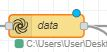

# Sandu-Emergency Detection & Handling using Wearable Device SCDFXIBM
"An idea that allows vulnerable populations to seek help immediately when emergency happens."

-Presented by Ng Wei Soon & Lim Hui Yi


## Contents

1. [Short description](#short-description)
1. [Demo video](#demo-video)
1. [The architecture](#the-architecture)
1. [Long description](#long-description)
1. [Getting started](#getting-started)
1. [Built with](#built-with)

## Short description

### What's the problem?

SCDF works closely with Community First Responders (CFRs) to provide timely relief and response to emergency situations. With the increasingly aging population and a growing segment of vulnerable populations in mind (e.g. increasing trend of elderly with no next of kin), how might we leverage analytics for better sense-making to be alerted at the onset of incidents which require emergency response (e.g. cardiac arrests, falls etc.) and mobilise CFRs for effective early intervention especially to the vulnerable populations?

### How can technology help?

With the advancement in electronic chips technology, small and convenient fitness tracker has become increasing common among the citizens as it allows the them to monitor thier health condition with just one button. Because of that, MOH are constantly making efforts to encourage citizens to wear a fitness tracker. On top of that, fitness tracker companies are also collaborating with Singapore HealthHub to give out subsidised or even free fitness trackers to the citizens. All these has put Singapore in a very good position to expand the usage of fitness tracker. Hence, we believe that SCDF can take advantage of this technology to further enhance the current emergency response system. 

### The idea

We believe that when emergency happen, wearable device is the most accessible device since it is worn on the patient's hand. If it is able to trigger a message to SCDF with just one 'click' when emergency happens, definitely, a much faster emergency response can be achieved. Hence, we come out with the idea to detect abnormal heart rate using wearable device and respond immediately by sending the incident to SCDF. Following are the proposed specifications:
* 1. Wearable device constantly checking user's heart rate.
* 2. Healthy heart rate of the user are stored beforehands to be used for heart rate abnormality detection. 
* 3. In the event where abnormal heart rate lasts for more than 3 minutes or fall is detected, user will be prompted a message to ask if they need help. Only one 'click' is needed to get help. 
* 4. If help is needed or no reponse from the user, a message is sent to SCDF immediately.
* 5. In the event where abnormal heart rate is too far away from range, SCDF will be informed directly.
* 6. Nobody except the user can access the user details unless emergency happens.

With that, SCDF can notify nearby CFRs to help the patient immediately and act accordingly. This function is particularly useful (but not restricted to) for single aging population as they are the most helpless group of people when emergency happens.

## Demo video

[](https://youtu.be/vOgCOoy_Bx0)

## The architecture


1. The user provide user details and normal heart rate data to Node Red. 
2. Wearable detect heart rate and send to Node Red.
3. Node Red analyse the heart rate.
4. During abnormal heart rate event that lasted more than 3 min, message prompted on wearable to ask whether the user needs help.
5. If user responds "Dismiss", no action is taken.
6. If user does not respond or respond "need help", Node Red send emergency message (containing user data and user current condition) to SCDF.
7. SCDF officers can send the info to CFRs through myResponder app.

## Long description

[More detail is available here](DESCRIPTION.md)


## Getting started

Steps to run the demo.

### 1. Install Node-RED [locally](https://nodered.org/docs/getting-started/).

After Node-RED is installed, add the dependencies:

```bash
npm install node-red-dashboard node-red-contrib-alasql node-red-contrib-prib-functions
```

### 2. Prepare inputs

* [Clone this repo](https://github.com/kanabu97/Sandu-Emergency_Detection-Handling_using_Wearable_Device_SCDFXIBM.git)
* Download and extract the zip file at the desired directory in local drive.


### 3. Import the Node-RED flow

* Navigate to the [nodered.json](https://github.com/kanabu97/Sandu-Emergency_Detection-Handling_using_Wearable_Device_SCDFXIBM/blob/master/nodered.json).
* Copy the content.
* On the Node-RED flow editor, click the Menu and select `Import` -> `Clipboard` and paste the contents.
* Import.
* Change the name od file of the following node to the directory of UserHRdata.csv downloaded.


* Change the directory path of the file in and out node to the desired directory to write and read the user details

 

### 4. Deploy the Node-RED flow by clicking on the `Deploy` button.

### 5. Steps to run the demo.

* Open dashboard in new window. The dashboard is the example of the screen that will be shown on the wearable device screen.
* Normal HR are simulated and injected at the interval of 10sec.
* Inject Abnormal Heart Rate(Normal) for 18 times and observe the dashboard pop-up.
* Observe the debug windows for the message that will be sent to SCDF.
* SCDF officers can then send the info to CFRs based on the seriousness of the event.
* Try to inject 'Fall Detected' and 'HeartRate > 400' and observe both dashboard and debug windows for the system output.


## Built with

* IBM Node Red


